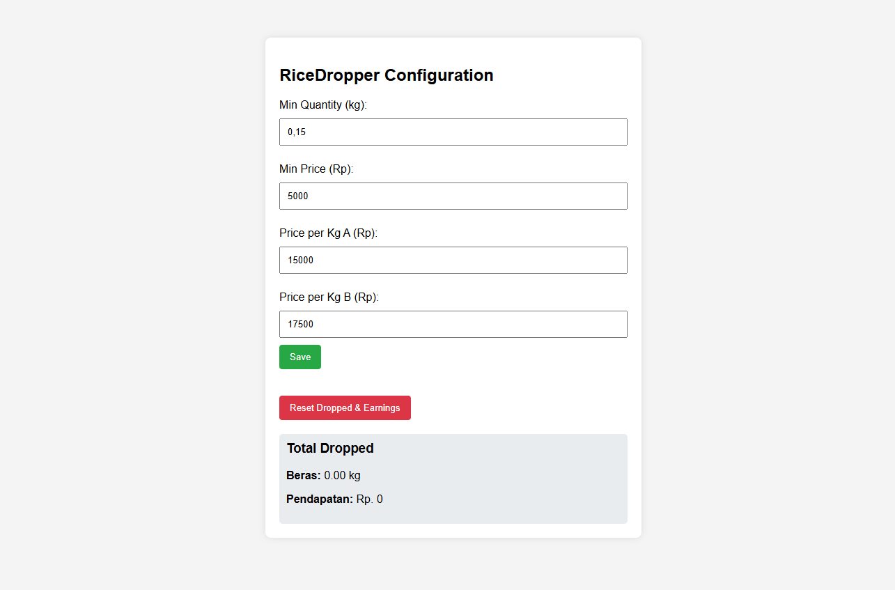
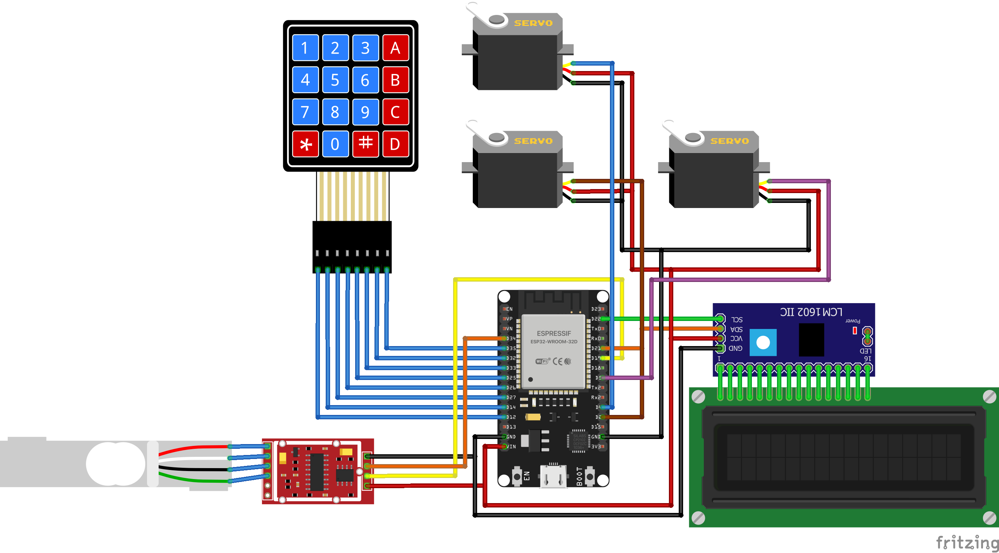

# RiceDropper

**RiceDropper** is an ESP32-based automatic rice dispenser that accepts user input via a keypad and allows configuration through a built-in webserver. It dispenses rice based on weight or price and logs total earnings and dropped weight.

---

## 🧰 Features

- Modes: Price-based and Weight-based dispensing
- Type selection for rice A or B (separate price settings)
- Minimum transaction threshold (price or quantity)
- Keypad and LCD UI for local interaction
- Web-based configuration UI (via Access Point)
- Persistent data storage using EEPROM
- Audio feedback and IP display via LCD
- Rollback support for last transaction
- Income and dropped weight reset
- Long press detection for advanced features

---

## 🔧 Hardware Requirements

| Component        | Details                     |
|------------------|-----------------------------|
| ESP32            | ESP32 DOIT V1 or equivalent |
| Load Cell        | HX711 ADC                   |
| Servo Motors     | 3x SG90 or compatible       |
| Keypad           | 4x4 matrix keypad           |
| LCD Display      | 16x2 I2C                    |
| Power Supply     | Sufficient for servo + ESP  |
| Buzzer           | Warning for rice runout     |
| Relay            | Sufficient for Buzzer       |

---

## 🌐 Web Configuration

When powered on, RiceDropper creates a Wi-Fi Access Point:

- **SSID:** `RiceDropperAP`
- **Password:** `password123`

Connect and open `http://192.168.4.1` to:
- Change min quantity / price
- Set price per kg for Rice A and B
- Reset dropped weight and total earnings

All settings are stored in EEPROM.

---

## ⌨️ Keypad Controls

| Key / Action     | Function                                 |
|------------------|------------------------------------------|
| A (hold)         | Set minimum quantity or price            |
| B (hold)         | Edit price per kg for selected type      |
| C (hold)         | Confirm reset earnings & weight          |
| D (hold)         | Show total income                        |
| # (hold)         | Rollback last transaction                |
| * (hold)         | Setting calfactor value                  |
| A                | Switch between weight/price mode         |
| B                | Toggle rice type (A/B)                   |
| D                | Start dispensing                         |
| #                | Backspace input                          |
| *                | Add decimal                              |
| C                | Clear input                              |

---

## 📝 Data Stored

- `pricePerKgA` / `pricePerKgB`
- `minPrice` / `minQuantity`
- `totalEarnings`
- `totalRiceDropped`
- `lastDropWeight` / `lastDropType`
- `calFactor`

All stored using EEPROM on the ESP32.

---

## 🚀 Getting Started

1. Clone this repo
2. Open the `.ino` file in Arduino IDE
3. Select the ESP32 board and correct COM port
4. Install required libraries:
   - `Keypad`
   - `LiquidCrystal_I2C`
   - `ESP32Servo`
   - `WiFi`
   - `WebServer`
   - `EEPROM`
   - `HX711_ADC`
5. Upload and power your ESP32

---

## 🧪 Notes

- Weight is rounded for transaction validation
- Prices are rounded to the nearest 500
- System uses a 60s timeout during dispensing
- Dispensing is blocked if minimums aren't met
- Buzzer will make a sound for 30 seconds when timeout (Rice runout)

---

## 📸 Screenshots

---

## 🛠 License

MIT — Use this freely for educational or commercial projects.

---

## ❤️ Credits

Project by [Rice Dispencer], powered by ESP32.
